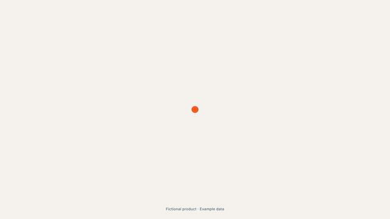
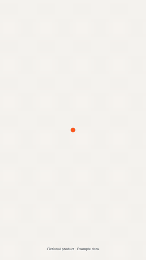

<h1 align="center">Motion Director</h1>

<p align="center">
  <b>claude-motion-director</b> · a Claude Code skill that directs and renders motion design videos from code
</p>

<p align="center">
  <a href="LICENSE"></a>
  <a href="CHANGELOG.md"></a>
  <a href="https://github.com/YOUR-USERNAME/claude-motion-director/stargazers"></a>
  <a href="https://github.com/YOUR-USERNAME/claude-motion-director/commits/main"></a>
  <a href="CONTRIBUTING.md"></a>
</p>

<p align="center">
  <a href="https://claude.com/claude-code"></a>
  <a href="https://github.com/heygen-com/hyperframes"></a>
  
  
  
</p>

<p align="center">
  
  
  
</p>

<p align="center">
  Launch films, product reels, showreels and animated explainers, in vertical, square and wide
  from one timeline. Built on <a href="https://github.com/heygen-com/hyperframes">HyperFrames</a>.
</p>

<p align="center">
  
</p>
<p align="center"><sub>Actova: a 30-second launch film made end to end with Motion Director.
Fictional product, example data. <a href="examples/actova">See the full run</a>.</sub></p>

## Why it exists

Opus 5.5 can write a video, but it can't make one on its own. It writes a program; a
browser turns that program into frames. A one-line prompt gets you a clip: centered text on a
gradient, everything fading in. The videos that look expensive come from the process around
the prompt: real product screens, a reference, a beat grid, springs instead of curves, sound
on measured peaks, and a model that looks at its own frames until they're good.

HyperFrames is an excellent engine for this. Motion Director is the **director layer** on top:

- **A guided process with gates:** brief → real assets → LOOK card → sound → shot list (you
  approve it) → scenes → critique loop → delivery
- **Scenes as clips:** each scene is its own file you can render and judge alone, then one
  film joined by shape handoffs (a scene's last frame is the next scene's first)
- **Motion that feels physical:** closed-form springs, stretching indicators, log-space camera,
  masked word rises, optional motion blur
- **Sound that lands:** beat and drop detection, effects placed on their measured hit, mixed to
  -14 LUFS, and a check that proves every effect landed within 10 ms
- **A critique loop:** stills before renders, contact sheets, phone test, pop scan, loop check,
  and a scoring prompt Claude runs until every score is 8 or higher
- **Truth rules:** no redrawn UI, no invented numbers, "Example data" when it's illustrative

## Requirements

- [Claude Code](https://claude.com/claude-code) (Opus 5.5 recommended, xhigh effort for new films)
- Node.js 22+ and FFmpeg
- Python 3 with numpy and scipy (`pip install -r scripts/requirements.txt`)
- HyperFrames 0.8.86 (installed per project by `new-project.sh`, pinned so renders stay identical)

## Install

```bash
git clone https://github.com/YOUR-USERNAME/claude-motion-director ~/.claude/skills/motion-director
pip install -r ~/.claude/skills/motion-director/scripts/requirements.txt
```

Then, once per machine, prove the pipeline:

```bash
bash ~/.claude/skills/motion-director/scripts/new-project.sh test-film
cd test-film && bash ~/.claude/skills/motion-director/scripts/smoke-test.sh
```

The smoke test checks the composition, renders the same frame twice to prove determinism,
and measures a test beep to prove sound lands on time.

## Use it

Ask Claude Code for a video. The skill takes it from there:

> Make a 20-second launch film for my app at https://example.com. Vertical and wide, it should loop.

> Turn these 8 screenshots into a 30-second product reel. Here's a song I licensed and two reference videos I love.

> Make a 15-second showreel that shows what you can do as a motion designer.

Claude will ask for everything it needs in one message, show you a LOOK card and a
beat-by-beat shot list for approval, build each scene as its own clip, run the critique loop,
and deliver every format with a note on what it would still change.

## How it works

| Step | What happens | Tools |
|---|---|---|
| 1. Intake | One message collects product, pain, features, payoff, formats, brand, music | `templates/brief.md` |
| 2. Assets | Real screens, logo, colors, fonts | `npx hyperframes capture` |
| 3. Look | 3 reference films → style guide + LOOK card with exact values | `scripts/review/ref-frames.sh` |
| 4. Sound | Tempo, beats, drop (from bass energy), effects measured | `scripts/audio/analyze.py`, `kit.py` |
| 5. Shot list | Beat-by-beat plan, handoffs, drop on the payoff. **You approve it.** | `templates/shotlist.md` |
| 6. Scenes | One file per scene, rendered alone as a clip | `scripts/clip.sh` |
| 7. Critique | Stills, sheets, pop scan, sync check, scores until all 8+ | `scripts/review/*`, `prompts/critique.md` |
| 8. Render | Every format from one timeline, sound mixed, attached, verified | `scripts/render-all.sh` |
| 9. Delivery | Checklist, final files, "what I'd still change" | `references/workflow.md` |

The full guides live in `references/`: `house-rules.md` (every film), `engine.md` (the rules
that break renders if ignored), `motion.md`, `sound.md` and `workflow.md`.

## Examples

**[Actova](examples/actova):** a fictional AI meeting assistant, built as a real mini web app and
then filmed. 30 seconds, 5 scenes, vertical + wide, seamless loop, 27 effects on the beat.
The folder has the brief, LOOK card, shot list, cue sheet and the full critique log, including
everything the run caught.

<p align="center"></p>

Note: the Actova example uses generated placeholder audio, not release-quality sound.

## Posting tips

- Frame one is the thumbnail on a muted feed: make it say the pain in words, or upload a thumbnail
- Assume no sound: every beat has to work as text on screen
- Wide for X, YouTube and websites; vertical for Reels, TikTok and Shorts
- Put the link in the first reply, not in the video

## Upgrading HyperFrames

Projects pin HyperFrames so re-renders stay identical. To move a project up:
`npx hyperframes@latest upgrade --project . --check`, then without `--check`. To change the
version new projects get, set `HF_VERSION` when running the scripts.

## Credits

- Engine: [HyperFrames](https://github.com/heygen-com/hyperframes) by HeyGen (Apache 2.0).
  Motion Director depends on it and does not include its code.
- Animation: [GSAP](https://gsap.com), installed from npm into each project under its own license
  (not included in this repo).
- Fonts in the example: Inter and Instrument Serif (SIL Open Font License), fetched from npm.
- Inspired by the Opus 5.5 motion design guides by Movez, Raphael Aubry and Muhammad Ayan, and
  by HeyGen's research on HTML-to-video rendering.

## License

MIT. See [LICENSE](LICENSE).
